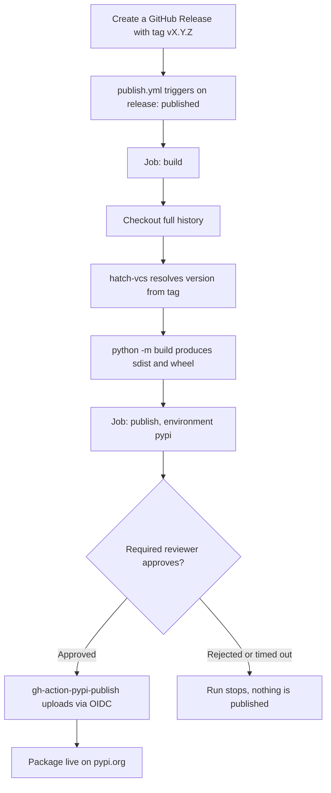
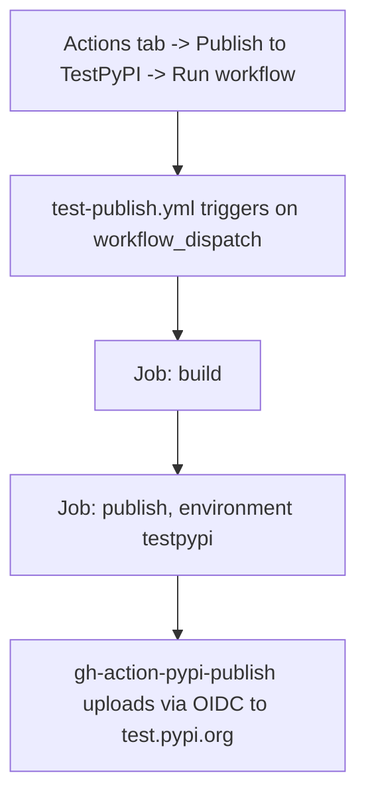

# Deployment

This project publishes to PyPI through two GitHub Actions workflows. There are no manual upload scripts and no API tokens stored anywhere: authentication uses PyPI's Trusted Publishing (OIDC), and the package version is derived automatically from git tags.

## Overview

| Workflow | File | Trigger | Target | Approval |
|---|---|---|---|---|
| Publish to PyPI | `.github/workflows/publish.yml` | GitHub Release published | pypi.org (production) | Required reviewer on the `pypi` environment |
| Publish to TestPyPI | `.github/workflows/test-publish.yml` | Manual (`workflow_dispatch`) | test.pypi.org | None |

## Versioning

The version is not stored as a static string anywhere in the codebase. `pyproject.toml` declares `dynamic = ["version"]` and delegates to `hatch-vcs`, which reads the nearest git tag reachable from the commit being built:

- Building exactly on a tag `vX.Y.Z` produces version `X.Y.Z`.
- Building on a commit that is ahead of the last tag produces `X.Y.Z.devN`, where `N` is the number of commits since that tag (the `local_scheme = "no-local-version"` setting drops the `+gHASH` suffix that PyPI would otherwise reject).

At runtime, `src/__init__.py` and the `tenty version` command both read the installed package's version via `importlib.metadata`, so there is nothing to keep in sync by hand.

Because of this, both workflows check out full git history (`fetch-depth: 0`) instead of the default shallow clone — a shallow clone has no tags, and `hatch-vcs` would be unable to compute a version.

## Trusted Publishing

Both PyPI and TestPyPI are configured with a Trusted Publisher pointing at this repository, so the workflows authenticate via short-lived OIDC tokens instead of stored secrets:

| Field | pypi.org | test.pypi.org |
|---|---|---|
| Repository | `Keniding/tenty-parser` | `Keniding/tenty-parser` |
| Workflow | `publish.yml` | `test-publish.yml` |
| Environment | `pypi` | `testpypi` |

The environment name in each workflow's `environment:` block must match what is configured on the PyPI side, or the OIDC exchange fails.

## Production release flow

A release only needs a tag and a title; no other manual step is required. The build step runs unconditionally, but the publish step pauses at the `pypi` environment gate until a reviewer approves it from the Actions run page.

Note on the reviewer gate: the `pypi` environment has `can_admins_bypass` enabled (GitHub's default). Repository admins are not blocked by the required-reviewer rule when they are also the ones triggering the run — the approval step is only enforced for non-admin triggers unless that setting is turned off.

## TestPyPI flow

TestPyPI has no reviewer gate and no branch/tag restriction — it exists to validate that a build and OIDC exchange succeed before cutting a real release. Re-running it against an unchanged commit fails with `400 File already exists`, since TestPyPI (like PyPI) rejects re-uploading an existing version; a fresh commit produces a new `.devN` version automatically.

## Environment protection rules

Configured under **Settings -> Environments** in the GitHub repository:

- **`pypi`**: required reviewer `Keniding`; deployment restricted to tags matching `v*` (configured as a *tag* rule, not a *branch* rule — GitHub's UI defaults new rules to branch type, which silently never matches a release since releases point at tags).
- **`testpypi`**: no protection rules.

## Cutting a release

1. Confirm the code on `main` is what should ship.
2. Create a release, e.g. `gh release create v0.1.3 --generate-notes` (or via the GitHub UI, selecting "Create new tag on publish").
3. Watch the run in the Actions tab. The `build` job completes on its own; the `publish` job waits at the `pypi` environment for review (unless bypassed as an admin, see above).
4. Approve the deployment. The package appears on PyPI within roughly a minute.

No file in the repository needs to be edited as part of this process.

## Superseded manual scripts

`deploy.sh` and `deploy.ps1` previously handled building and uploading by hand, including editing a static `version = "..."` field in `pyproject.toml` and regenerating `src/__init__.py`. They were removed once the version became dynamic (`dynamic = ["version"]` has no static field left to edit) and the GitHub Actions workflows took over both build and upload.
