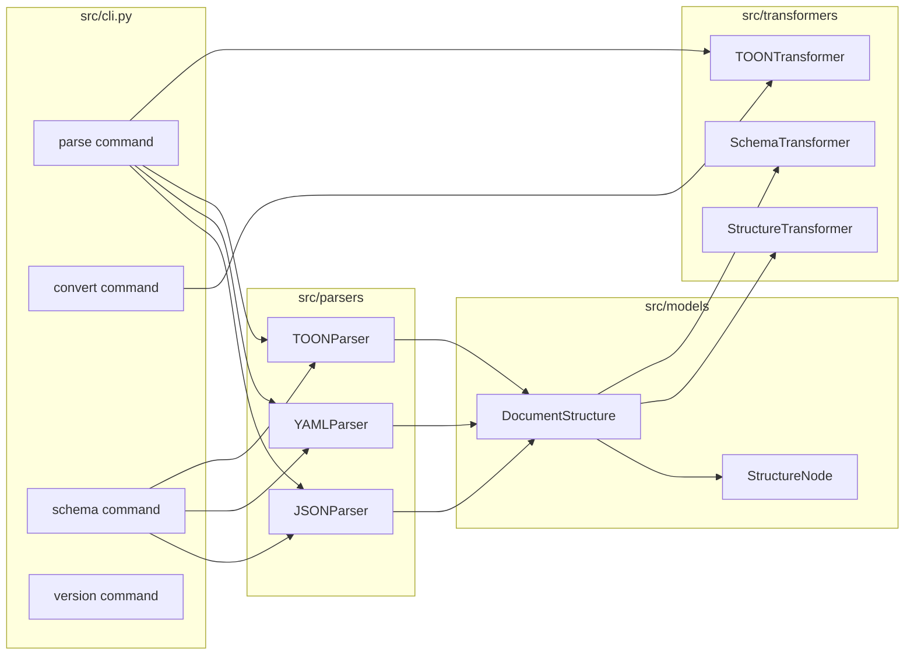
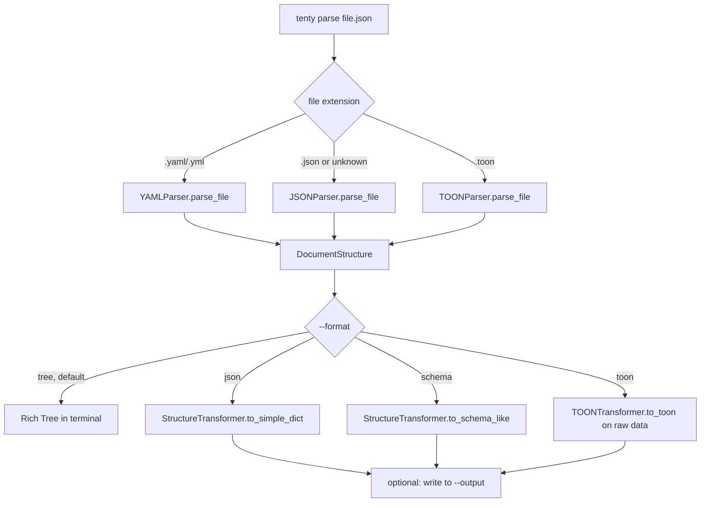

# Functionality

Tenty Parser is a CLI built with Typer that reads structured data (JSON, YAML, TOON), normalizes it into an internal tree representation, and renders that tree into whatever output format was requested: a visual tree, JSON, a converted file, a JSON Schema / OpenAPI Schema, or TOON.

## Components

- **Parsers** (`src/parsers/`) read a file of a given format and build a `DocumentStructure`, a tree of `StructureNode` (`src/models/structure.py`) describing types, examples, and nesting.
- **Transformers** (`src/transformers/`) take that structure (or, for TOON, raw data) and produce an output representation: a plain dict, a JSON-Schema-like dict, a JSON Schema, an OpenAPI Schema, or a TOON string.
- **`cli.py`** wires Typer commands to the parser/transformer combination each command needs, and handles file I/O and console output (via Rich).

`convert` does not go through the `DocumentStructure` model at all — it reads the source file into a plain Python object (`json.load` / `yaml.safe_load`) and writes it back out in the target format directly, which is why it supports JSON/YAML/TOON but does not need a parser class for JSON or YAML source files.

## Commands

### `tenty parse <file>`

Reads a JSON, YAML, or TOON file, builds its `DocumentStructure`, and prints it. The `--format` option controls the rendering:

An unrecognized extension falls back to the JSON parser with a warning rather than failing outright.

### `tenty convert <input> <output> --to <format>`

Reads the input file (JSON or YAML) into a plain Python object and writes it back out as JSON, YAML, or TOON, based on `--to`. This is a direct format-to-format conversion, independent of the `DocumentStructure` model used by `parse` and `schema`.

### `tenty schema <file> --format <jsonschema|openapi>`

Same parsing step as `parse`, but always renders through `SchemaTransformer`, producing either a JSON Schema or an OpenAPI-style schema document, with an optional `--title` and `--output` file.

### `tenty version`

Reads the installed package version via `importlib.metadata.version("tenty-parser")` and prints it — see [deployment.md](./deployment.md) for how that version is produced at build time.

## Notes

- File reads that may contain a UTF-8 BOM (`parse --format toon` and `convert`) open with `encoding='utf-8-sig'` to strip it; other reads use plain `utf-8`.
- Errors (missing file, parse failure, unknown format) print a message via Rich and exit with status 1 rather than raising a traceback.
